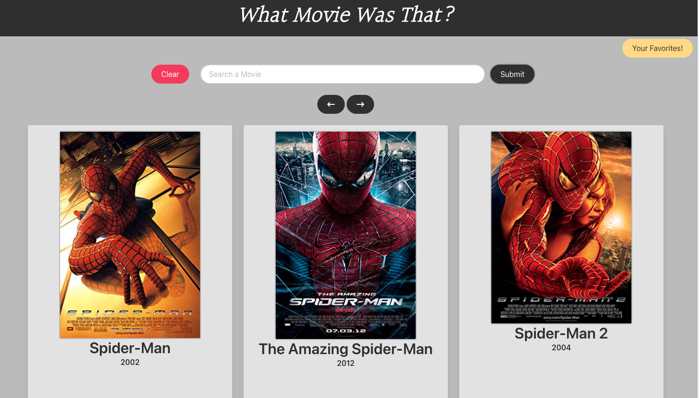
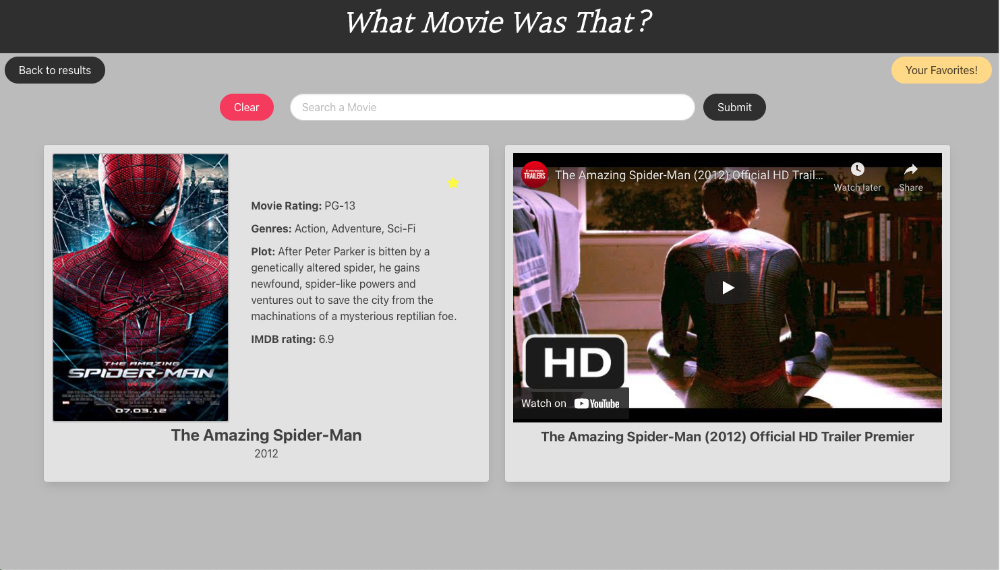
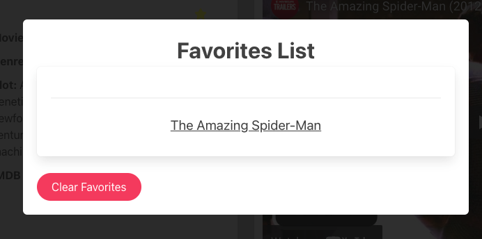

# What Movie Was That?

## Description
"What Movie Was That?" is an all in one movie searching application powered by OMDB. It allows users to find new movies, save their favorites and watch the trailers of said movies through the Youtube API.

## Screenshots







## Deployed App
[What Movie Was That](https://samif812.github.io/What-Movie-Was-That-/)


## Usage


```
Type any movie into the searchbar
Returns a list of 3 movies with their movie posters
After clicking on a poster
Returns Movie Rating,  Genre, Plot, IMDB rating and a trailer
```

## Contributors

[Sami Fares](https://github.com/SamiF812)

[Brian Halpin](https://github.com/bthalpin)

[Jeffrey Feringa](https://github.com/jeffreyferinga)


<a href="https://github.com/SamiF812/What-Movie-Was-That-/graphs/contributors">
  
</a>

Made with [contrib.rocks](https://contrib.rocks).


## License

[](https://opensource.org/licenses/MIT)

Copyright (c) 2022 SamiF812
